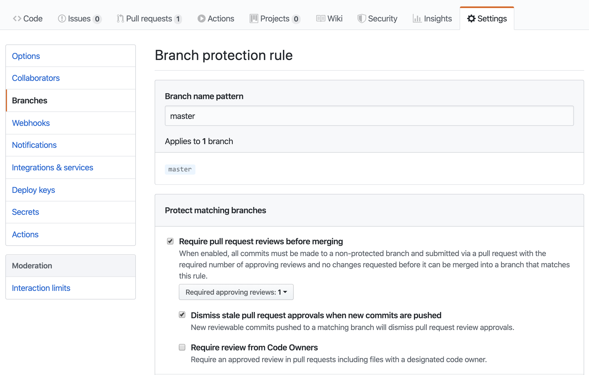

# Jekyll Netlify Boilerplate with CircleCI, JS/CSS Compression, and HTML Proofing

This repository is a working example/template for integrating CircleCI into your Netlify continuous integration
flow. The general strategy is outlined in the Netlify community post advising how to
[Test your Netlify Builds](https://community.netlify.com/t/common-issue-testing-your-netlify-builds/1456). The applicable section is “Acceptance Testing”.

This is a fork of https://github.com/danurbanowicz/jekyll-netlify-boilerplate -- **A really simple Jekyll template for creating a fast, static website on Netlify with
a continuous deployment workflow.**

# Replacing Netlify's Automatic Deployment Scheme (so we can control it more granularly)

Standard Netlify CMS workflow works like this:
1. When the Netlify CMS is used to save/update content, a new github branch and Pull Request are created. Netlify will also automatically generate a preview site at a ``` *.netlify.com ``` URL. Note that the status (Draft / In Review / Ready) on a post or page in the CMS GUI only updates the in-CMS workflow. There is no change propagated to github.
2. Any subsequent updates and changes by the Content Creator show up as commits on the branch created in the previous interaction.
3. When the content creator clicks the "Publish" button, the github branch is merged into the production branch and the site is deployed.  

Given the requirement that some sort of automated tests pass prior to publication -- this template raises errors if HTML is malformed or dead links are present --
we need to disable the default netlify Auto-Deploy behavior and instead let CircleCI push the build if and only if the tests pass:

1. Disable your Netlify Auto-Deploy. See the Netlify docs on [Locked Deploys](https://docs.netlify.com/site-deploys/manage-deploys/#locked-deploys). Note that the netlify site administrator(s) can still override at ``` https://app.netlify.com/sites/(your-site-slug)/deploys ``` -- None of the magic herein can override that ability. Presumably your content creators do not have access to this interface. :-)
2. Create a Netlify Build Hook url at ``` https://app.netlify.com/sites/(your-site-slug)/settings/deploys ```.
3. Edit the .circleci/config.yml file herein to include your Netlify Build Hook URL. This is so CircleCI can trigger the deploy.

### Suggestion (Optional)
Configure your github repository
with a Branch Protection Rule ( Your Repo >> Settings >> Branches >> Branch protection rules ). Peer reviews are a good thing, and CircleCI
will still deploy your site to Netlify using the scheme described herein -- when the tests pass post-merge.
Note that the protected branch should be the "production branch" specified in Netlify, which is master by default.



# About the Example Jekyll Site
Notes from @danurbanowicz:

* Minimal styling, ready to make your own
* Example blog posts, pages and contact form
* Responsive CSS Grid layout with fallbacks for older browsers
* Continuous Deployment workflow via Netlify and Github
* Netlify CMS for managing content
* Netlify Identity for authenticating users
* Netlify Forms for processing your static HTML forms with reCAPTCHA
* Optional Netlify `_redirects` and `_headers` files ready to use
* Jekyll SASS pipeline
* Minified HTML and CSS

Based on Netlify's [Jekyll + Netlify CMS](https://github.com/netlify-templates/jekyll-netlify-cms) starter template, head over there for more details on deployment and build settings or to get help with setting up Netlify.

For help with templates, local development and other Jekyll related stuff, check out the excellent [Jekyll Docs](https://jekyllrb.com/docs/home/).

<!-- ## [View Demo](https://jekyll-netlify-boilerplate.netlify.com/) -->

<!-- ## Performance

You can test the demo site's TTFB (Time To First Byte) at [testmysite.io](https://testmysite.io/5b50abe51f12b74b81dd5442/jekyll-netlify-boilerplate.netlify.com) -->

## Getting started

Use this deploy button to get your own copy of the repository deployed to Netlify:

[](https://app.netlify.com/start/deploy?repository=https://github.com/fuery/jekyll-netlify-circleci&stack=cms)

This will setup everything needed for running the CMS:

* A new repository in your GitHub account with the code
* Full Continuous Deployment to Netlify's global CDN network
* Control users and access with Netlify Identity
* Manage content with Netlify CMS

### Setup authentication

After deploying this project, Netlify Identity will add you as a CMS user and
will email you an invite. It is not necessary to accept this invite if you wish
to use an
[OAuth provider](https://www.netlify.com/docs/identity/#external-provider-login)
(e.g. Github) to manage authentication for your CMS.
It is recommended to use this method of authentication as it removes the need
for an email & password to log in to the CMS and is generally more secure. You
will need to add an OAuth provider in your Netlify app settings under
"Settings" > "Identity" > "External providers".

Next, navigate to `/admin` on your site, choose your OAuth provider from the
login box and you should then be logged into your CMS.

Now you're all set, and you can start editing content!

**Note:** if you switch the repo that was created to private, you'll need to regenerate your token,
as the token generated using the deploy to Netlify button can only access public repositories. To
regenerate your token, head to "Settings" in your Netlify site dashboard, go to the "Identity"
section, then scroll to "Services" where you'll see an "Edit settings" button. Click that and you'll
see a text link to "Generate access token in GitHub".

## Local Development

Clone this repository and run:

```bash
bundle install
bundle exec jekyll server --watch
```
Jekyll will watch your project folder for changes.

Now navigate to [localhost:4000](http://localhost:4000/) to preview the site, and
[localhost:4000/admin](http://localhost:4000/admin) to log into the CMS.

## Bug reports, feature requests, etc

This is a living project. Report an issue or submit a PR.

If you need any help with setting up Netlify CMS, you can reach out to the Netlify team in the [Netlify CMS Gitter](https://gitter.im/netlify/netlifycms).
